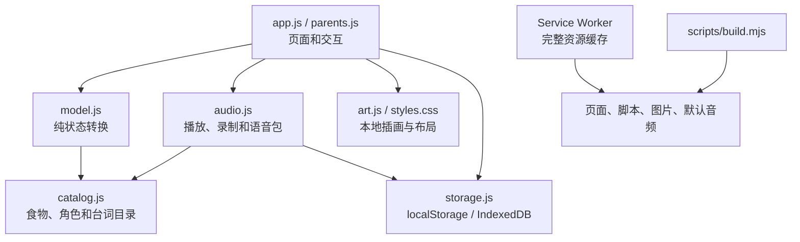

# 技术架构

## 当前架构是一个无后端的本地优先PWA

浏览器加载静态HTML、CSS、JavaScript、SVG和音频。游戏规则由纯状态模型处理，DOM只负责呈现和把儿童操作转换为动作。Service Worker缓存完整资源，使安装到桌面的入口可以离线启动。



应用没有第三方运行时依赖，没有业务API，也不需要账号。

## 模块职责保持清楚

| 文件 | 职责 |
| --- | --- |
| `public/js/catalog.js` | 食物、量词、角色、默认设置、全部台词ID和音频路径 |
| `public/js/model.js` | 创建会话、生成订单、取放、计数、判断、轮次、计时和旧存档迁移 |
| `public/js/app.js` | 儿童页面、事件分发、拖动、暂停恢复和模型渲染 |
| `public/js/art.js` | 动物、食物和通用图标的内联SVG |
| `public/js/parents.js` | 家长设置、逐句录音、试听、导入导出和离线管理界面 |
| `public/js/audio.js` | 串行播放、麦克风录制、PCM WAV转换、语音包校验 |
| `public/js/storage.js` | 设置和会话的localStorage封装、录音的IndexedDB事务 |
| `public/js/offline.js` | Service Worker注册、完整性检查、修复和显式更新 |
| `scripts/sw-template.js` | 构建时使用的Service Worker模板 |
| `scripts/build.mjs` | 复制发布资源、生成清单版本和Service Worker |

新增规则优先写进 `model.js`，并通过动作驱动，不要在DOM事件中维护第二份游戏状态。

## 状态模型维护数量守恒

每个食物对象都有稳定的 `id` 和 `food`。`stock` 表示一轮中存在的全部食物，`plate` 表示已装盘的子集；锅中内容由二者的差集得到。取放改变位置，不创建或复制食物。

主要不变量：

- 点餐模式的 `stock.length` 等于订单数量，且全部是目标食物。
- 分类和自由厨房每轮只选三种食物，每种两个。
- 一个物体不能同时出现在锅和盘子，也不能重复出现在盘子。
- 盘子最多五个食物。
- 每个盘内物体在一次计数状态中最多计数一次。
- `finished` 会话不能再响应儿童操作。

保存会话时包含订单、物体身份、盘子、计数标记、轮次和已用时。恢复旧会话要做结构校验；不合法数据应放弃恢复，而不是部分信任。

## 数据按用途分开保存

| 数据 | 存储 | 清除后的影响 |
| --- | --- | --- |
| 游戏设置、当前会话、最近摘要 | `localStorage`，前缀 `little-kitchen:` | 恢复默认设置，当前游戏和摘要丢失 |
| 家人录音 | IndexedDB `little-kitchen-voices/clips` | 家人配音丢失，可从语音包恢复 |
| 页面和默认资源 | Cache Storage | 需要联网重新准备离线资源 |

浏览器、添加到桌面的PWA入口以及不同浏览器可能使用不同存储空间。任何功能都不能承诺浏览器数据永久存在。

## 语音包是当前的跨设备边界

每条录音以 `角色/台词ID` 为键，保存为22.05kHz、单声道、16位PCM WAV。导出文件结构为：

```json
{
  "format": "little-kitchen-voices",
  "version": 1,
  "exportedAt": "ISO-8601 时间",
  "clips": [
    {
      "key": "rabbit/order-dumpling-3",
      "mime": "audio/wav",
      "data": "base64 音频"
    }
  ]
}
```

导入必须先检查格式、版本、台词ID、重复键、MIME、文件大小和浏览器可解码性。全部通过后再请家长确认，并用一次IndexedDB事务提交。失败时保留原录音。

录音不进入构建产物、不上传服务器，也不提交Git。未来如果增加云同步或声音生成，需要先更新隐私边界、数据流程和删除机制，不能直接复用当前“只在本机”的说明。

## 离线更新使用完整资源快照

构建脚本为全部静态文件生成内容版本和资源清单。Service Worker先把新版本下载到临时缓存，确认所有资源存在后才提交；失败时删除临时缓存并继续保留旧版本。游戏中不自动刷新，更新入口只出现在首页或家长区。

Cloudflare Pages会把 `/index.html` 重定向到 `/`。缓存导航响应时需要保存普通响应，避免旧版Chrome在读取带重定向标记的缓存时出现 `ERR_FAILED`。相关回归测试在 `tests/deployment.mjs`。

## 修改后按影响范围验证

```bash
npm test
npm run build
```

改变DOM、触控、录音或离线流程时，在本地服务运行期间执行：

```bash
npm start
npm run test:browser
```

改变Service Worker或部署行为时再执行：

```bash
npm run test:deployment
```

自动化测试不能替代iPad Safari和Android Chrome真机验收。真实麦克风、桌面安装、断网冷启动、横竖屏和双设备语音包转移都要按 [验收记录](./ACCEPTANCE.md) 检查。
