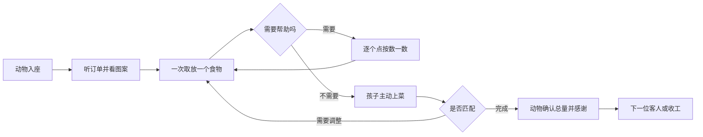

# 产品与交互设计

## 让孩子先理解“我要做什么”

儿童端用动物、食物图案、数字和语音共同表达任务。文字主要帮助照护者，不应成为孩子完成游戏的前提。每个页面只突出一个主要动作，反馈一次只处理一个问题。

设计优先级依次是：

1. 看得懂食物和目标。
2. 点得到、拿得回、改得了。
3. 听得清订单和反馈。
4. 能把数字、实际物体和数数联系起来。
5. 愿意继续尝试，也能平静结束。

## 儿童端保持一条短流程

数量凑齐时不自动提交。孩子点击“上菜”后，游戏才判断当前盘子。错误不会清空盘子，也不会移动食物代替孩子完成。

## 三种模式承担不同任务

| 模式 | 孩子正在做什么 | 画面中的食物 |
| --- | --- | --- |
| 动物点餐 | 按种类和数量准备一份订单 | 只出现目标食物，数量与订单完全相同 |
| 食物分类 | 把相同食物放到对应图案的盘子 | 每轮三种，每种两个，共六个 |
| 自由厨房 | 自由搭配、请动物吃饭，也可以数数 | 每轮三种，每种两个，盘子最多五个 |

不要在点餐模式加入干扰食物。需要练习种类区分时，使用分类模式。

## 数一数是可选择的帮助

进入计数状态后，盘内物体暂时不能移动。孩子每点一个尚未数过的食物，界面留下序号标记并播放下一个数词；重复点击同一物体不重复计数。全部点完后说出总量。

退出计数状态后可以继续取放。盘子发生变化时，旧计数标记清除。数数不替孩子判断订单，也不要求每轮都使用。

## 反馈只告诉孩子下一步能做什么

| 情况 | 反馈重点 |
| --- | --- |
| 食物种类不符 | 突出订单食物：“看看，我想吃的是……” |
| 数量少 | 提醒还少一点，并邀请一起数数 |
| 数量多 | 提醒可以拿回去再看看 |
| 连续两次未匹配 | 临时展开完整份数图案，便于一一比较 |
| 分类放错 | 食物留在原处，提醒看盘子图案 |
| 没有操作 | 安静等待，不催促、不倒数 |

不使用红叉、失败音效、扣分、动物生气或连续奖励。游戏记录只帮助家长了解本次体验，不显示能力结论。

## 食物插画以幼儿辨认为标准

每种食物使用独立轮廓、结构线索和颜色组合，不能只靠颜色区分。图案在锅、盘、订单和分类目标中使用同一套画法。

| 食物 | 主要辨认线索 |
| --- | --- |
| 水饺 | 半月形、鼓起的肚子和清楚的褶边 |
| 大虾 | 弯曲身体、头和眼睛、长触须、分节和尾部 |
| 排骨 | 一块肉、肉的纹理、仅从两侧露出一点的短白骨头 |
| 西蓝花 | 多个绿色花球和粗短菜梗 |
| 青菜 | 向外展开的叶片和浅色菜帮 |
| 香菇 | 宽伞盖、菌褶和短柄 |
| 包子 | 圆鼓外形和顶部收拢褶纹 |

修改食物图案时，至少在实际游戏尺寸下检查：缩小后轮廓是否仍清楚、同屏食物是否容易混淆、孩子是否需要文字才能猜到。幼儿试用反馈优先于成人对画面精致度的偏好。

## 触控适合尚不精确的小手

- 核心按钮和食物触摸区域至少为72×72 CSS像素。
- 点击是完整操作路径，拖动只作为补充。
- 一次操作只移动一个有固定身份的食物，单个指针生效。
- 靠近有效盘子时吸附，落在无效区域时回到原位。
- 不要求双指、长距离精确拖动、快速连续点击或阅读长文字。
- 横屏是主要布局，竖屏上下排列；旋转后保持当前订单和盘子。

## 声音保持温和、短而完整

小兔子和小熊轮流说话。家人录音是在扮演角色，可以由妈妈、爸爸或其他家人自由分配，不绑定角色性别。

- 一条录音是一句完整台词，最长15秒。
- 订单先说动作、数量和食物，例如“我想吃三只虾”。
- 计数按孩子点按节奏逐个播放，不自动一口气数完。
- 语音串行播放；切换订单、退出或进入后台时停止旧语音。
- 默认无背景音乐，避免与语言争夺注意力。
- 未录制条目立即使用默认语音，不让不完整的语音包阻断游戏。

## 家长区负责准备，不侵入儿童流程

家长入口需要长按3秒再确认，用于防止孩子误触。家长可以设置下一局玩法、管理配音和备份、检查离线资源、跳过或提前收工。设置从下一次开局生效，避免正在玩的画面突然变化。

录音流程为：选择角色和台词 → 开始录音 → 停止 → 试听 → 保存或重录。麦克风只在主动录音时启用，取消、离开或切后台立即释放。

## 收尾比无限续玩更重要

点餐和分类最多三轮，默认每次五分钟。剩余约一分钟时只给温和语音提示，不显示儿童倒计时。达到轮数或时间后进入收尾页，不自动开始下一局，也不要求做对才能结束。

时间到时保留未完成的盘子，并说“今天先做到这里”，不能把未完成订单描述成成功。
